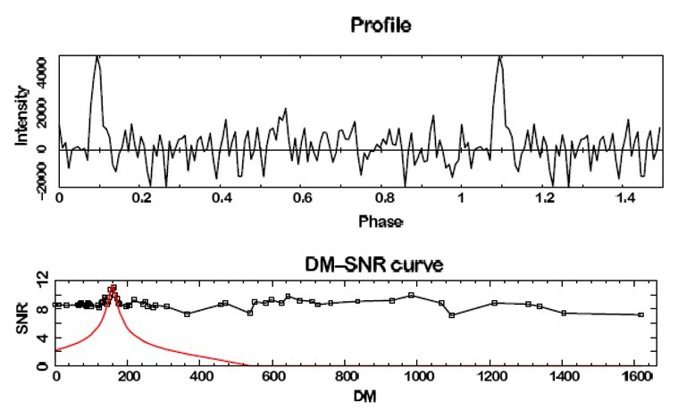
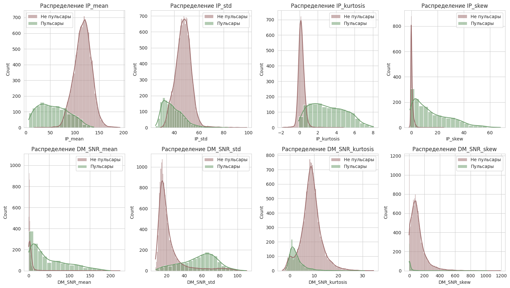
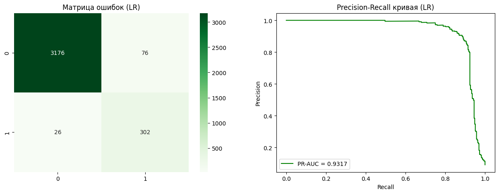
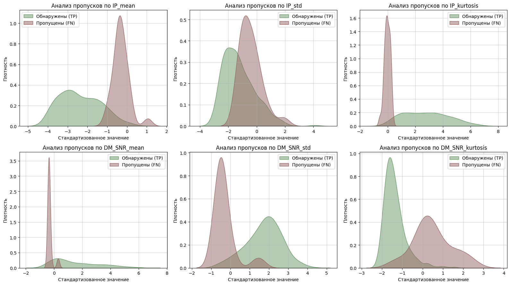

# Pulsar Star Classification / Классификация пульсаров

Этот проект посвящен автоматизации поиска пульсаров — быстро вращающихся нейтронных звезд — среди огромного массива радиоастрономических данных.

## Описание задачи
Современные радиотелескопы генерируют петабайты данных, и ручной поиск сигналов становится невозможным.
Используется открытый датасет [HTRU2](https://archive.ics.uci.edu/dataset/372/htru2) (High Time Resolution Universe Survey - одного из наиболее масштабных радиообзоров южного неба, выполненного на радиотелескопе Murriyang обсерватории Parkes в Австралии в период 1997-2001 гг) - 17 898 объектов.

Каждый объект описывается восемью признаками:
* 4 признака интегрированного профиля (медиана, стандартное отклонение, асимметрия, эксцесс),
* 4 признака кривой DM-SNR (те же статистики).

*(Интегрированный профиль импульса и DM-SNR кривая для пульсара PSR J1926+0739)*

Основная сложность задачи - сильный дисбаланс классов - реальные пульсары составляют лишь 9-10% выборки, остальное - радиопомехи и шум.

Проект является развитием моего учебного научного исследования «[Сравнительный анализ методов машинного обучения для обнаружения пульсаров в радиоастрономических данных](https://www.elibrary.ru/item.asp?id=82629615)». В ходе первичного анализа была выявлена критическая проблема: значительное число пульсаров принимались за шум (FN). Текущая работа направлена на пересмотр метрик и применение моделей, устойчивых к дисбалансу.

## Особенности проекта:
* Математическая фильтрация признаков: Математическое обоснование удаления признаков через анализ корреляции.
* Приоритет физической достоверности: Обоснование неэффективности SMOTE/ADASYN для данных реальных физических процессов.
* Анализ ошибок: Анализ пропусков моделей через физику сигнала

## Технологический стек:
* Processing: `Pandas`, `NumPy`
* Scaling: `StandardScaler`
* Metrics: Recall, F1-score, PR-AUC, MCC
* Modeling:  `Scikit-learn` (Logistic Regression, Random Forest, SVM), `XGBoost`
* Visualization: `Matplotlib`, `Seaborn`

## Логика работы:
### 1. Загрузка и первичный анализ 
Анализ распределения показал, что реальные пульсары составляют лишь примерно 9% выборки. 
Гистограммы распределения выявили, что признаки IP_mean, IP_kurtosis и DM_SNR_mean обладают наилучшей разделительной способностью. В данных присутствуют экстремальные значения, что типично для радиоастрономических наблюдений, это подтвердило необходимость стандартизации данных.

В ходе анализа корреляции признаков была обнаружена высокая линейная зависимость (>0.92) между асимметрией и эксцессом как интегрированного профиля, так и DM-SNR кривой. Было принято решение исключить параметры асимметрии как избыточные. 

### 2. Выбор метрик и стратегии обучения
Эксперименты с искусственной балансировкой (ADASYN, RandomUnderSampler) показали рост ложных срабатываний и нарушение естественной структуры распределения физических сигналов. Был принят подход обучения на исходных данных с использованием встроенных весов классов `class_weight='balanced'`. Accuracy бесполезна при дисбалансе, акцент сделан на **Recall** (не пропустить сигнал) и **PR-AUC** (качество поиска при редком классе). Использован коэффициент **MCC** для наиболее объективной оценки матрицы ошибок.

### 3. Сравнение моделей и оптимизация
После Baseline-тестирования для финальной настройки были выбраны Logistic Regression (лидер по полноте) и XGBoost (лучший баланс).
Был проведен поиск оптимальных параметров через GridSearchCV. 
  * для LR подбиралась сила регуляризации ($C$) и тип штрафа.
  * для XGBoost: Настраивалась глубина деревьев и скорость обучения для предотвращения переобучения.

Несмотря на рост сложности, базовая логистическая регрессия сохранила лидерство по совокупности метрик. 
Результаты финальной модели (Logistic Regression):
* Recall: 0.92 — модель находит 302 из 328 пульсаров на тестовой выборке.
* Precision: 0.80 — существенно меньше ложных срабатываний (76 FP) по сравнению с оптимизированным XGBoost (111 FP).
* F1 / MCC: 0.855 / 0.842 — лучшие показатели стабильности при дисбалансе.

### 4. Кросс-валидация
Проведена 10-фолдовая кросс-валидация для оценки работы моделей на разных подмножествах данных.
Результат: XGBoost показал чуть большую стабильность среднего Recall ($0.919$ против $0.906$), однако был отвергнут из-за сильно более низкого Precision.

### 5. Анализ ошибок модели
Анализ распределения пропущенных (FN) и обнаруженных (TP) пульсаров  показал, что пропущенные имеют более высокое значение `IP_mean` и аномально низкий `IP_kurtosis` по сравнению с обнаруженными.
Физически это означает, что их радиосигнал более «размытый» и слабый. Статистически такие объекты почти неотличимы от обычного шума. Это говорит о том, что модель сталкивается с физическим пределом данных.

